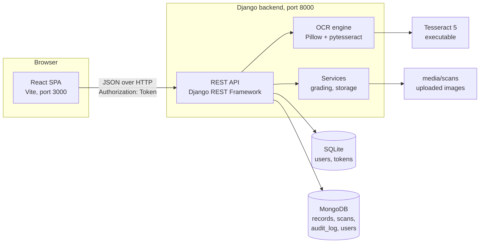
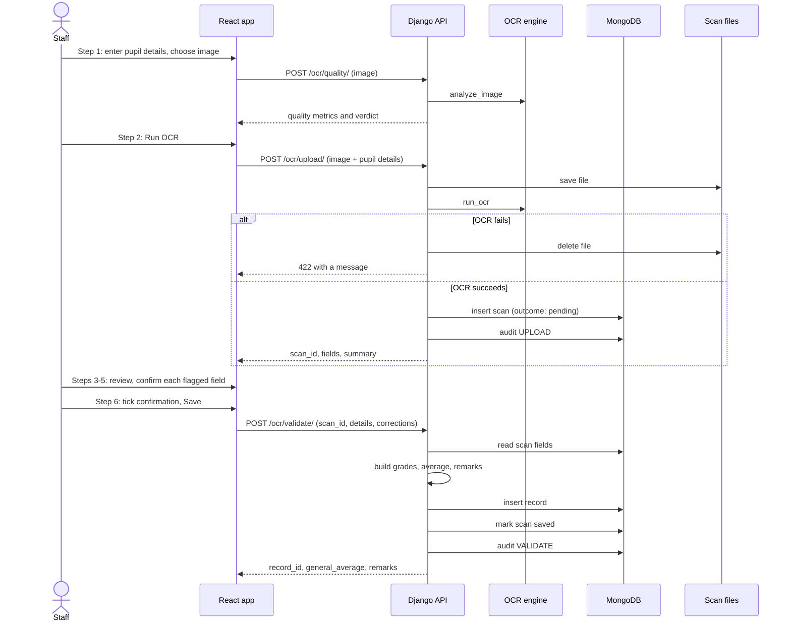
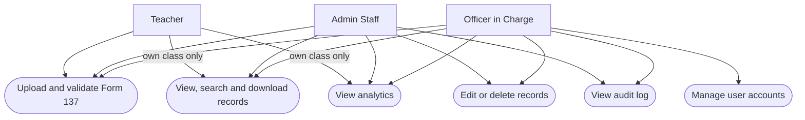

# System Architecture

## 1. Overview

OCRIS is a three-tier web application:

1. A **React single-page application** in the browser.
2. A **Django REST API** that holds the business logic and the OCR engine.
3. **Two data stores**: SQLite for user accounts, MongoDB for records, scans and the audit log. Uploaded images are kept on the server's disk.



### Why two databases

- **SQLite** holds what Django's authentication system manages: user accounts, hashed passwords and login tokens. Using Django's built-in user model gives password hashing, the admin site and token authentication without extra code.
- **MongoDB** holds the school data. A Form 137 record is a natural document: the set of subjects differs between forms and year levels, and each record carries a nested grade sheet. Storing it as one document avoids a fixed schema of subject columns.

SQLite is the source of truth for users. A copy of each user (without the password) is mirrored to a MongoDB `users` collection for reference.

## 2. Backend

Location: `backend/`. Framework: Django 4.2 with Django REST Framework.

```
backend/
  manage.py
  seed.py                   creates the default accounts
  requirements.txt
  ocris_backend/
    settings.py             configuration (reads .env)
    urls.py                 /admin/ and /api/
  api/
    models.py               OCRISUser: roles, class assignment, class access check
    authentication.py       token authentication with expiry
    permissions.py          IsOIC, IsOICOrAdmin
    tests.py                automated tests
    management/commands/    backup, cleanup_scans, recompute_remarks
    serializers.py          login, user, and validation payloads
    urls.py                 all /api/ routes
    constants.py            passing grade, N/A handling, remark names
    db.py                   every MongoDB read and write
    views/
      auth.py               login, logout, current user, change password
      records.py            list, search, filter options, detail, create (typed-in forms), update, delete
      ocr.py                quality check, upload, validate, download, history
      analytics.py          grade analytics
      sections.py           the section tree: list, add, edit, delete
      users.py              user management
      audit.py              audit log
    services/
      grading.py            builds the grade sheet, average, and remarks
      storage.py            saves and finds uploaded files
    ocr/
      engine.py             read_scan / run_ocr entry points, error handling, retry on a smoothed copy
      pdf.py                opens a scan as an image; renders page 1 of a PDF
      quality.py            image quality measurements
      preprocess.py         straightening and clean-up before OCR
      table.py              reads the grade table cell by cell; one or two table columns (SF10-ES)
      parser.py             subject names; free-text fallback parser
      pupil.py              reads name, LRN, grade, section, school year
    utils/http.py           small request and response helpers; the teacher's-own-class check
```

### Layering

| Layer | Modules | Responsibility |
|---|---|---|
| Routing | `api/urls.py` | Maps URLs to view functions |
| Views | `api/views/*` | Check permissions, read the request, call the layers below, write the audit log, shape the response |
| Services | `api/services/*` | Business rules that do not depend on HTTP: grading and file storage |
| OCR | `api/ocr/*` | Everything about turning an image into fields |
| Data access | `api/db.py`, `api/models.py` | MongoDB queries and the Django user model |

Views are function-based (`@api_view`). Each declares its allowed methods and its permission class directly above the function, so the access rule for an endpoint can be read in one place.

## 3. Frontend

Location: `frontend/`. React 18 built with Vite. No router library and no state library are used.

```
frontend/src/
  main.jsx                  entry point
  App.jsx                   maps page names to page components
  context/AppContext.jsx    login state, current page, nav()
  data/constants.js         sidebar items, option lists, role labels
  utils/
    api.js                  HTTP client for the backend
    useFetch.js             load-data hook (data, loading, error, refetch)
    useObjectUrl.js         image previews
    useRecordOptions.js     filter choices taken from saved records
    useClassPicker.js       grade and section choices from the section tree; locked for teachers
    format.js               dates, N/A checks, error messages
    compare.js              tolerant text comparison
  components/
    layout/Sidebar.jsx      navigation
    layout/Topbar.jsx       page title, menu button on narrow screens, change password, sign out
    layout/ChangePasswordModal.jsx
    ui/index.jsx            Card, Btn, Badge, Pager, EmptyState, ...
    ui/DownloadScanBtn.jsx  download button for the original scan
    ui/ScanPreview.jsx      shows an uploaded scan (image or PDF)
    ui/Chart.jsx            Chart.js charts for Grade Analytics
  assets/                   DepEd seal and logo for the SF10-ES sheet
  pages/
    LoginPage, DashboardPage, UploadPage, RecordsPage, RecordDetailPage,
    SearchPage, AnalyticsPage, HistoryPage, UsersPage, AuditPage,
    SectionsPage, FillFormPage
    upload/                 one component per upload step
    users/                  add form, edit dialog, permission matrix
    sections/               add/edit and delete-confirmation windows
    form137/                the SF10-ES sheet (sheet.jsx) and the print button
  styles/                   global.css, components.css, pages.css
```

### Navigation and state

- `AppContext` holds `loggedIn`, `user`, `activePage` and `navParams`.
- Pages change screen by calling `nav('records')` or `nav('detail', { recordId })`. `App.jsx` looks the page name up in its `PAGES` table.
- The sidebar and the top-bar titles are both generated from `NAV_ITEMS` in `data/constants.js`. An item can list the roles allowed to see it; `App.jsx` applies the same rule to the page itself.
- After a page refresh, `AppContext` asks the server who the stored token belongs to (`GET /auth/me/`) and restores the session, so the user stays signed in.
- The upload wizard (`UploadPage.jsx`) keeps the data gathered so far in one object and passes it to each step.

### Talking to the backend

All requests go through `utils/api.js`, which:

- adds the `Authorization: Token <token>` header from `localStorage`;
- on a `401` response, clears the token and returns to the login screen;
- throws `{ status, data }` for HTTP errors and `{ status: 0, offline: true }` when the server cannot be reached, so pages can show a suitable message;
- downloads files by fetching them as a blob, because a plain link cannot send the token header.

## 4. Main data flow: digitizing a form



Two points in this flow are deliberate design decisions:

- **The scan and the record are separate documents.** The scan keeps what the machine read; the record keeps what a person approved. The record's `corrections` field and the scan's `ocr_fields` together show exactly what was changed by hand.
- **The pupil details on the record come from what the staff member typed, not from OCR.** The details read from the scan are only used to warn when they disagree with what was typed.

The OCR stage itself is described in [OCR_PIPELINE.md](OCR_PIPELINE.md).

## 5. Users and roles



Roles are stored on the user model (`OCRISUser.role`). Permissions are enforced by the backend on every request; the exact rule for each endpoint is in [SECURITY.md](SECURITY.md) and [API.md](API.md).

## 6. Configuration

All environment-specific settings are read from `backend/.env` and `frontend/.env`; see [INSTALLATION.md](INSTALLATION.md). Settings fixed in `settings.py` that affect behaviour:

| Setting | Value | Effect |
|---|---|---|
| `TIME_ZONE` | `Asia/Manila` | Django's time zone |
| `TOKEN_TTL_HOURS` | 12 (from `.env`) | Hours a sign-in stays valid |
| `DATA_UPLOAD_MAX_MEMORY_SIZE` | 20 MB | Largest accepted upload |
| `OCR_LANG` | `eng` | Tesseract language |
| `OCR_CONFIDENCE_THRESHOLD` | 90 | Auto-approval threshold used by the free-text fallback parser |
| `PAGE_SIZE` (`api/db.py`) | 20 | Rows per page in lists |
| `PASSING_GRADE` (`api/constants.py`) | 75 | Used for remarks, pass rates and intervention flags |
