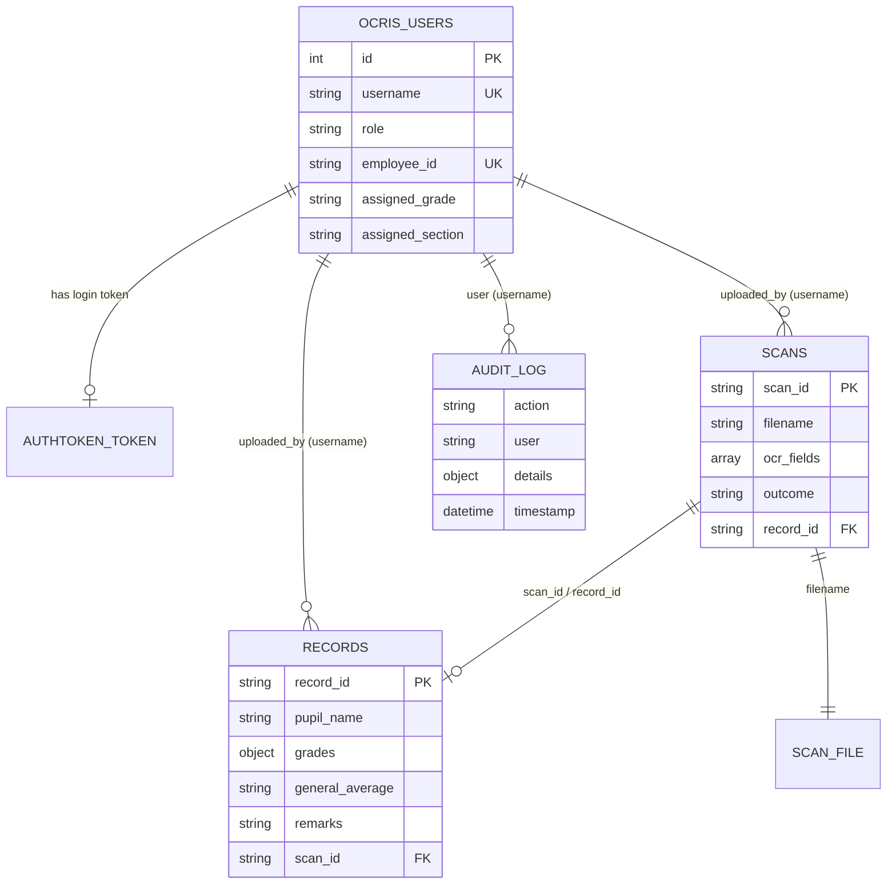

# Database Design and Data Dictionary

OCRIS uses two databases and a file folder.

| Store | Holds | Defined in |
|---|---|---|
| SQLite (`backend/db.sqlite3`) | User accounts, login tokens | `backend/api/models.py`, Django migrations |
| MongoDB (database named by `MONGO_DB_NAME`) | `records`, `scans`, `audit_log`, `users` | `backend/api/db.py` |
| File system (`backend/media/scans/`) | Uploaded scan images | `backend/api/services/storage.py` |

## Relationships

MongoDB does not enforce relationships. The links below are kept by the application.



Users are referenced by **username stored as text**, not by ID. This is why deleting a user account leaves that user's records, scans and audit entries intact.

---

## MongoDB collections

All dates are stored in UTC and sent by the API with a `Z` suffix (for example `2026-10-01T05:12:44.118000Z`), so browsers show them in local time. MongoDB's own `_id` field exists on every document but is never returned by the API.

### `records`

One document per validated Form 137. Created by `POST /api/ocr/validate/`.

| Field | Type | Description | Example |
|---|---|---|---|
| `record_id` | string | Unique ID: `REC-<year>-<8 hex characters>` | `REC-2026-7C1E4A90` |
| `pupil_name` | string | As typed at upload: `Last name, First name` | `Santos, Maria Joy L.` |
| `lrn` | string | Learner Reference Number; may be empty | `104512090034` |
| `grade_level` | string | As chosen at upload | `Grade 6` |
| `section` | string | As typed at upload | `Sampaguita` |
| `school_year` | string | As chosen at upload | `2024-2025` |
| `class_adviser` | string | Reserved; not set by the current upload flow | `""` |
| `grades` | object | Grade sheet, see below | |
| `general_average` | string or null | Mean of numeric Final grades, one decimal place | `"86.4"` |
| `remarks` | string | `Promoted`, `Retained` or `Incomplete` | `Promoted` |
| `status` | string | Always `validated` | `validated` |
| `uploaded_by` | string | Username of the person who saved the record | `g.ramos` |
| `scan_id` | string | The scan this record was made from | `SCAN-3F9A1C2B` |
| `corrections` | object | Values entered by hand during validation, keyed by field name | `{"English I Q2": "88"}` |
| `created_at` | datetime | When the record was saved | |
| `updated_at` | datetime | Last change | |

**`grades`** maps each subject to its quarterly and final grades. Values are strings; a blank grade is `"N/A"`.

```json
{
  "English I":     { "Q1": "87", "Q2": "88", "Q3": "85", "Q4": "90", "final": "88" },
  "Mathematics I": { "Q1": "80", "Q2": "N/A", "Q3": "82", "Q4": "84", "final": "82" }
}
```

On a multi-year Form 137-A the subject key includes the year level (`English I`, `English II`).

### `scans`

One document per successful OCR run. Created by `POST /api/ocr/upload/`.

| Field | Type | Description | Example |
|---|---|---|---|
| `scan_id` | string | Unique ID: `SCAN-<8 hex characters>` | `SCAN-3F9A1C2B` |
| `filename` | string | Name of the stored file in `media/scans/`: `<8 random characters>_<sanitized original name>` | `1197b7a9_form137.png` |
| `original_name` | string | The filename as uploaded; used when downloading | `form137.png` |
| `file_size_bytes` | integer | Size of the upload | `2483112` |
| `uploaded_by` | string | Username | `g.ramos` |
| `pupil_name` | string | As typed at upload | |
| `grade_level` | string | As chosen at upload | |
| `section` | string | As typed at upload | |
| `school_year` | string | As chosen at upload | |
| `lrn` | string | As typed at upload | |
| `ocr_fields` | array | Everything OCR read, see below | |
| `overall_conf` | number | Mean confidence of fields with a confidence above 0 | `88.4` |
| `flags_count` | integer | Fields flagged for review | `14` |
| `null_count` | integer | Blank fields | `3` |
| `corrections_count` | integer | Corrections submitted at validation; 0 until saved | `14` |
| `outcome` | string | `pending` after upload, `saved` after validation | `saved` |
| `record_id` | string or null | The record made from this scan | `REC-2026-7C1E4A90` |
| `created_at` | datetime | When the scan was uploaded | |

**`ocr_fields`** items:

| Key | Type | Description |
|---|---|---|
| `field` | string | Field name, e.g. `Pupil Name`, `English I Q1` |
| `raw` | string | What OCR read |
| `value` | string | Interpreted value, or `N/A` |
| `conf` | integer | Confidence, 0–100 |
| `status` | string | `ok`, `warn` or `null` |
| `flagged` | boolean | `true` when `status` is `warn` |

### `audit_log`

One document per logged action. Never updated or deleted by the application.

| Field | Type | Description |
|---|---|---|
| `action` | string | See the table below |
| `user` | string | Username of the person who did it |
| `details` | object | Depends on the action |
| `timestamp` | datetime | When it happened |

| Action | Written when | `details` |
|---|---|---|
| `LOGIN` | A user logs in | `role` |
| `UPLOAD` | A scan is uploaded and read | `scan_id`, `filename`, `confidence`, `pupil` |
| `VALIDATE` | A record is saved | `scan_id`, `record_id`, `corrections` (count), `pupil`, `grade` |
| `EDIT` | A record is updated | `record_id`, `fields` (names of the fields changed) |
| `DELETE` | A record is deleted, with its scan | `record_id`, `pupil` |
| `DOWNLOAD` | An original scan is downloaded | `scan_id`, `filename`, `pupil` |
| `CREATE_USER` | A user account is created | `new_user`, `role` |
| `DELETE_USER` | A user account is deleted | `deleted_user`, `role` |
| `EDIT_USER` | A user account is changed | `target_user`, `fields` |
| `RESET_PASSWORD` | The OIC sets a user's password | `target_user` |
| `CHANGE_PASSWORD` | A user changes their own password | none |

### `users`

A mirror of the SQLite user table, without passwords. It is refreshed when the user list is viewed and when a user is created, edited or deleted. SQLite is the source of truth; nothing reads this collection.

| Field | Type | Description |
|---|---|---|
| `username` | string | Unique key for the mirror |
| `full_name` | string | |
| `email` | string | |
| `role` | string | `OIC`, `ADMIN` or `TEACHER` |
| `employee_id` | string | |
| `assigned_grade` | string or null | |
| `assigned_section` | string or null | |
| `is_active` | boolean | |
| `synced_at` | datetime | Last time this entry was written |

---

## SQLite tables

### `ocris_users`

Model: `OCRISUser`, which extends Django's `AbstractUser`.

| Column | Type | Description |
|---|---|---|
| `id` | integer, primary key | |
| `username` | varchar(150), unique | Login name |
| `password` | varchar(128) | Hashed by Django (PBKDF2); never stored in plain text |
| `first_name`, `last_name` | varchar(150) | |
| `email` | varchar(254) | Optional |
| `is_active` | boolean | `false` blocks login (a deactivated account) |
| `is_staff`, `is_superuser` | boolean | Used only by the Django admin site |
| `last_login`, `date_joined` | datetime | |
| `role` | varchar(10) | `OIC`, `ADMIN` or `TEACHER`; default `TEACHER` |
| `employee_id` | varchar(20), unique, nullable | |
| `assigned_grade` | varchar(20), nullable | Teacher's class, e.g. `Grade 6` |
| `assigned_section` | varchar(50), nullable | Teacher's class, e.g. `Sampaguita` |

### `authtoken_token`

Provided by Django REST Framework.

| Column | Type | Description |
|---|---|---|
| `key` | varchar(40), primary key | The token sent in the `Authorization` header |
| `user_id` | integer, unique | The owner; one token per user |
| `created` | datetime | |

A token is created at first login. Each later login reuses it and resets `created` to the current time; the token stops working `TOKEN_TTL_HOURS` (12) hours after that. It is deleted on logout, when the OIC resets the user's password, and when the account is deleted.

The remaining SQLite tables (`django_session`, `auth_group`, `auth_permission`, `django_admin_log`, and so on) are standard Django tables and are not used by OCRIS's own features.

---

## Uploaded files

| | |
|---|---|
| Folder | `backend/media/scans/` |
| Stored name | `<8 random hex characters>_<original name with unsafe characters replaced by _>` |
| Linked from | `scans.filename` |

The random prefix stops two uploads with the same filename from overwriting each other. Files are only served through `GET /api/ocr/scans/<scan_id>/file/`, which checks that the resolved path is inside this folder.
