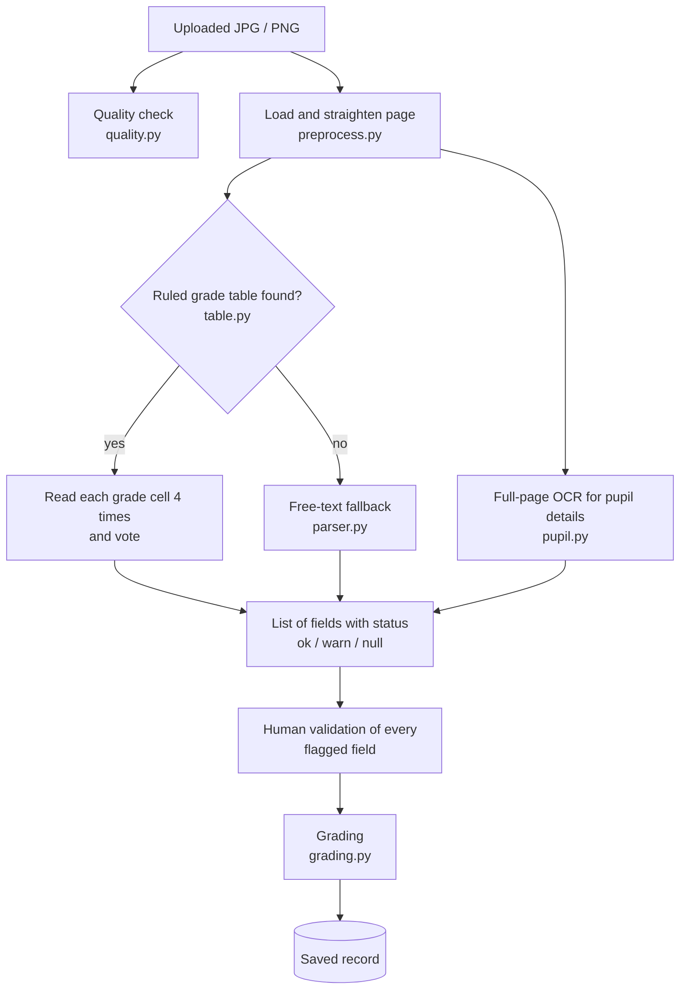

# OCR Pipeline

This document explains how a scanned image becomes a saved record. The code is in `backend/api/ocr/` and `backend/api/services/grading.py`.

## 1. Stages



Supported input: one JPG, PNG or PDF file per upload, up to 20 MB. A PDF's first page is rendered to an image at 300 DPI (`ocr/pdf.py`, using `pypdfium2`) and then goes through the same steps as an image; its other pages are not read.

Two form layouts are read:

| Layout | How its grade tables are found |
|---|---|
| Form 137-A (and other single-column forms) | One table column; year blocks are stacked down the page and named by the level after each subject ("English I", "English II"). |
| SF10-ES (elementary, formerly Form 137) | Two tables side by side, four year blocks in all. The page is split at the blank strip between the tables (`find_gutter` in `ocr/table.py`) and each half is read as its own table. A block is named after its "Classified as Grade" line ("Filipino Grade 4"). If those grades do not run in increasing order, one was misread, and all blocks fall back to "Block 1" to "Block 4". Blocks and learning-area rows with no grades are left out, and so is the Remedial Classes table. |

The learner's name on an SF10-ES is read from the "LAST NAME: … FIRST NAME: …" line.

SF10-ES accuracy was measured on filled-in copies of the form (Revised 2025 front page), 130 grades each. The first group is a PDF filled in on a computer and rougher copies made from it; the second is copies of the blank form filled in for testing, and the app's own Fill Out Form 137 sheet printed to PDF.

| Copy | Correct and auto-approved | Flagged for review | Wrong and auto-approved |
|---|---|---|---|
| PDF filled in on a computer | 105 | 25 | 0 |
| ... as a 200 DPI scan, tilted 0.9°, JPEG | 126 | 4 | 0 |
| ... as a 150 DPI scan, tilted 1.4° | 127 | 3 | 0 |
| ... as a 180 DPI image with no DPI information, tilted 2.2° | 125 | 5 | 0 |
| ... faded and grainy, 200 DPI | 86 | 24 | 0 |
| Clean typed copy | 124 | 6 | 0 |
| 200 DPI, tilted 0.8°, JPEG | 128 | 2 | 0 |
| Handwriting-style font | 31 | 99 | 0 |
| App's printed sheet | 123 | 7 | 0 |

These figures are with the 90% confidence rule (`OCR_CONFIDENCE_THRESHOLD=90`), measured on 2026-10-10. Nearly every flagged grade on the clean copies already showed the right value and was held back only because its confidence was 90% or lower. On the faded copy, 4 of the 26 subject rows (20 grades) were not found at all: the grain broke up their table lines. On the Form 137-A sample, 22 of 90 grades are auto-approved under this rule; under the earlier rule (agreement with a confidence floor of 50) it was 76, also with none wrong.

These are generated copies, not scans of paper that real pens and scanners have touched; re-check on real forms.

What keeps hard scans readable:

- **PDFs filled in on a computer.** Entries typed into a PDF are kept apart from the printed page, as form fields or as text boxes laid over it. Both are drawn when the page is rendered (`ocr/pdf.py`); otherwise the page comes out as the blank form.
- **Grainy or faded scans.** When fewer than 85% of a table's grades are auto-approved, a lightly smoothed copy of the page is read as well and the better result is kept (`smoothed()` in `ocr/preprocess.py`). This roughly doubles the reading time for those scans only.
- **Learning areas that can't be read.** Inside a grade table, a first cell that matches no learning area is read again at two other sizes, then matched more loosely. If it still matches nothing and the row has grades, the row is kept as "Unread learning area" and its grades are shown, instead of being left out.
- **Learner details.** The page's words are read twice, binarised and as plain grey; each field is taken from the better reading. A section name is corrected to the closest one on the Sections page.

## 2. Image quality check

Module: `quality.py`. Endpoint: `POST /api/ocr/quality/`. Nothing is saved.

Six measurements are taken from the actual pixels. Each is rated Good, Acceptable (fair) or Poor.

| Check | How it is measured | Good | Acceptable | Poor |
|---|---|---|---|---|
| Resolution | DPI from the file metadata. If missing or 72 (a placeholder value), estimated as image width ÷ 8.5 inches, the width of the form's paper. | ≥ 250 DPI | ≥ 150 DPI | below 150 |
| Contrast | Difference between the 95th and 5th percentile grey levels | ≥ 150 | ≥ 100 | below 100 |
| Brightness | Mean grey level (0–255) | 150–245 | 110–149, or above 245 | below 110 |
| Sharpness | Variance of a Laplacian edge filter on a copy 1000 px wide | ≥ 1000 | ≥ 300 | below 300 |
| Page tilt | The rotation, searched from −5° to +5° in 0.25° steps, that gives the sharpest horizontal text-row profile | ≤ 1° | up to 5° | 5° or more, or no text found |
| Ink coverage | Share of pixels darker than the midpoint between ink and paper | up to 25% | above 25% | below 0.5% (blank) or above 40% (shadows) |

The **overall verdict is the worst single check**. A Poor verdict does not block OCR; the screen recommends choosing another scan but still offers "Run OCR anyway".

## 3. Preprocessing

Module: `preprocess.py`.

1. **`load_page`** opens the image, converts it to greyscale and measures the tilt. If the tilt is 0.5° or more, the page is rotated level. Both readers below use this straightened page.
2. **`prepare_for_text`** (used for full-page reading) stretches the contrast, sharpens, enlarges scans below 250 DPI to an equivalent 300 DPI, converts to pure black and white, and removes speckles with a median filter.

## 4. Reading the grade table

Module: `table.py`. This is the main reader.

**The problem it solves.** When Tesseract reads a whole ruled table as text, the grid lines become junk characters and digits are misread. The table reader instead finds the grid and reads each cell separately.

**Expected column order:** Subject | Q1 | Q2 | Q3 | Q4 | Final | (anything else is ignored).

### Step 1: find the grid

- A **horizontal line** is a pixel row where at least 45% of the page width is darker than the paper. A looser darkness test is used here so thin lines that fade to grey on low-resolution scans are still found.
- A **vertical line** is a column inked over at least 90% of the full height between two horizontal lines. Letters leave a gap above and below, so they do not qualify.
- A vertical line only counts if at least 3 rows within 3 rows either side have a line at the same position (within 3 px). This rejects tall characters such as "(" that look like a line in a single row.
- A row more than 1.6 times the usual height is treated as two rows whose dividing line faded, and is split at its strongest horizontal line.

### Step 2: find subject rows

Only the first cell of each row is read as text. It is matched against the known subjects:

| Text on the form | Stored as |
|---|---|
| Filipino | Filipino |
| English | English |
| Math, Mathematics | Mathematics |
| Science | Science |
| Araling Panlipunan, AP | Araling Panlipunan |
| Edukasyon sa Pagpapakatao, EsP | Edukasyon sa Pagpapakatao |
| Technology and Livelihood Education, TLE, EPP | EPP / TLE |
| MAPEH | MAPEH |
| MAKABAYAN | MAKABAYAN |

If no exact pattern matches, a fuzzy match (similarity of at least 0.8) catches misreads such as "Filipina". Rows that match no subject, such as header rows, are ignored.

### Step 3: group rows into year blocks

A secondary Form 137-A has one grade table per school year, so the same subject appears more than once. Consecutive subject rows form a **block**; a new block starts when rows are not adjacent or a subject repeats.

- The **year level** of a block (I, II, III, …) is read from the text after each subject name (for example "English II") and decided by majority vote within the block. Common misreads of "I" as "l", "|" or "1" are corrected.
- If no level can be read and the form has several blocks, the block's position is used so that field names stay distinct.
- All rows in a block share **one column layout**, decided by majority vote, so a line that is faint in one row cannot shift that row's grades into the wrong column.

### Step 4: read each grade cell and vote

Each grade cell is cropped inside its borders and read by Tesseract in digits-only mode **four times, at heights of 48, 40, 56 and 32 px**.

A grade is **auto-approved** (`status: ok`) only if all of these hold:

1. at least 3 of the readings give the same grade;
2. that grade is between 60 and 100;
3. no reading gives a different valid grade;
4. the mean Tesseract confidence of the agreeing readings is above 90%. This is the `OCR_CONFIDENCE_THRESHOLD` setting (in `backend/.env`); lowering it approves more grades automatically and leaves fewer for review, at more risk of a wrong one.

Otherwise:

| Situation | Result |
|---|---|
| The cell has almost no ink (under 0.6% dark pixels) | Blank: value `N/A`, `status: null` |
| Readings give two different valid grades | Flagged; the raw value shows both, e.g. `88 / 83` |
| Ink is present but no valid grade is read | Flagged; shown as unreadable (`?` or the text that was read) |
| A valid grade is read but without enough agreement or confidence | Flagged with the value read |
| The grade columns of a subject row cannot be located | The subject is still listed, with every grade flagged for manual entry |

The principle is that **a wrong grade should be flagged, never silently accepted**. Agreement between independent readings is required because a single reading can be confidently wrong.

## 5. Free-text fallback

Module: `parser.py`. Used only when no ruled table with subject rows is found.

The page is read as plain text. Each line containing a subject name is scanned for up to five grade values (60–100) or N/A markers, in the order Q1, Q2, Q3, Q4, Final. A table of common misreads of handwritten digits (for example `B5` → `85`) is applied. A value is auto-approved when Tesseract's word confidence is at least 90; lower confidence is flagged. If the average confidence is below 60, the page is read again with stronger preprocessing.

## 6. Reading the pupil details

Module: `pupil.py`. Read from a full-page OCR pass.

| Field | How it is read |
|---|---|
| Pupil name | On a Form 137-A, from the line above the `(Surname)` and `(Given Name)` labels; each word is assigned to the label it sits above, so multi-word surnames work. Otherwise from a `Name: …` label. Output format: `SURNAME, GIVEN NAMES`. |
| LRN | `LRN:` followed by 10 to 12 digits |
| Grade level | `Grade N` if printed. Otherwise the year levels read from the grade table, e.g. `Year I, Year II`. |
| Section | Every `Section …` on the page, joined with commas |
| School year | Every `School Year …` or `S.Y. …`, including underlined blanks such as `20_09_ - 20_10_`. Misread digits are corrected (O, Q, D → 0; I, l, \| → 1). The start year must be between 1950 and next year. A fully readable end year must equal start + 1 or the match is rejected. |

Confidence for each value is the mean Tesseract confidence of the words it was read from.

**These values are not saved on the record.** The record uses the details typed in step 1 of the upload. The scanned details are compared with the typed ones, and step 4 shows a warning when they disagree:

- name: similarity below 85% after removing spaces and punctuation;
- section: no scanned section is at least 80% similar;
- school year: the typed year is not among those on the scan;
- grade level: compared only when the scan shows `Grade N`.

## 7. Output format

`run_ocr` returns a list of fields. The five pupil fields come first, then the grades.

```json
{ "field": "English II Q1", "raw": "87", "value": "87", "conf": 91, "status": "ok", "flagged": false }
```

| Key | Meaning |
|---|---|
| `field` | Field name. Grades are `<Subject> [<Level>] <Q1\|Q2\|Q3\|Q4\|Final>`, e.g. `Mathematics I Final`. A repeated name gets `#2`, `#3`, … |
| `raw` | What OCR read before interpretation |
| `value` | The interpreted value, or `N/A` |
| `conf` | Confidence, 0–100 |
| `status` | `ok` (auto-approved), `warn` (flagged for review), `null` (blank) |
| `flagged` | `true` when `status` is `warn` |

The summary returned with an upload counts `total`, `auto_approved`, `flagged` and `null_count`, and gives `overall_conf`, the mean confidence of fields with a confidence above 0.

## 8. Failures

`run_ocr` raises `OCRError` with a message that is safe to show the user. The upload endpoint returns it as HTTP 422, creates no scan, and deletes the uploaded file.

| Situation | Message |
|---|---|
| File is not an image or a PDF | "This file couldn't be read. Upload the scan as a JPG, PNG or PDF." |
| PDF is damaged or password-protected | "This PDF couldn't be opened. It may be damaged or password-protected." |
| Tesseract executable missing | "The OCR engine (Tesseract) was not found on the server. Set TESSERACT_CMD in the backend .env." |
| Python OCR libraries missing | "The OCR engine is not installed on the server." |
| No grade rows found | "No grade rows were found on this scan. Check that the whole grade table is visible and try rescanning." |
| Any other error (details in the server log) | "OCR failed on this scan. Try rescanning it." |

## 9. Human validation

Every field with `status: warn` must be confirmed by a person before the record can be saved (upload step 5). For each one the reviewer types the correct value or marks it N/A. The values entered are sent as `corrections` and take priority over the OCR values.

## 10. Grading

Module: `services/grading.py`. Runs when the record is saved.

1. **Build the grade sheet.** Field names are split into subject and column, giving `{subject: {Q1, Q2, Q3, Q4, final}}`. A correction replaces the OCR value for the same field.
2. **General average.** The mean of all numeric Final grades, rounded to one decimal place. Blank (N/A) and non-numeric Finals are skipped. If there are no numeric Finals, there is no average.
3. **Remarks**, decided in this order:

| Order | Condition | Remarks |
|---|---|---|
| 1 | Any numeric Final is below 75 | **Retained** |
| 2 | There is no numeric Final at all, or any Final is filled in but not a number | **Incomplete** |
| 3 | The average is at least 75 and every Final is at least 75 | **Promoted** |
| 4 | Otherwise | **Retained** |

On a multi-year Form 137-A, the average and remarks are computed across every year block on the page, because all blocks are saved in one record.

## 11. Measured accuracy

These results were recorded during development and are reproduced from [CHANGELOG.md](../CHANGELOG.md), sections 9 and 10. They come from **one form layout**: a Form 137-A mockup with two year blocks (90 grade cells), tested in 12 variants (original, enlarged, tilted both ways, blurred, JPEG quality 60, 40 and 25, shrunk to 1000, 900 and 800 px wide, and with added noise), for 1,080 grade cells in total.

| Measure | Result |
|---|---|
| Grades found with the correct subject and year | 1,080 of 1,080 |
| Correct grades auto-approved | 788 (76 of 90 on the original image) |
| **Wrong grades auto-approved** | **0** |
| Flagged for a person to check | 292 |
| Time per upload | about 17 seconds |
| Pupil details on the original image | all five fields correct |

**Scope of these numbers.** They have not been measured on real scanned school records, on elementary Form 137 / SF10 layouts, or on handwritten grades. Because approval requires agreement between readings, unfamiliar layouts and handwriting are expected to be flagged for review more often, which increases manual work but should not introduce wrong grades. This expectation should be confirmed on real scans; see [LIMITATIONS.md](LIMITATIONS.md).
